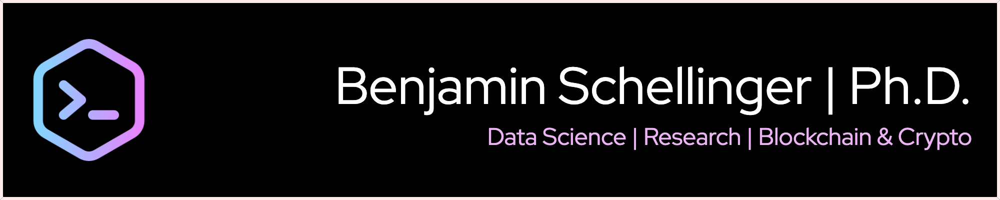

<!--
-->

## Hey, I'm Benjamin!

*Digital Asset Analyst & Researcher*</i></h3>

###  About Me
- 🎓 PhD in Information Systems Engineering.
- 🏦 5+ years in Research & Finance.
- 🔗 30+ publications in Blockchain, Crypto & DeFi.
- ❤️ Passion for analyzing digital asset markets & building tools to simplify complexity.

### Engage with Me
- 📰 View my Blog [Substack](https://digitalfinancebriefing.substack.com/)
- 👨‍🔬 Read my Research on [Google Scholar](https://scholar.google.com/citations?user=c71Xi4IAAAAJ&hl=de)
- 📫 Get in touch via [LinkedIn](https://www.linkedin.com/in/benjaminschellinger/)
